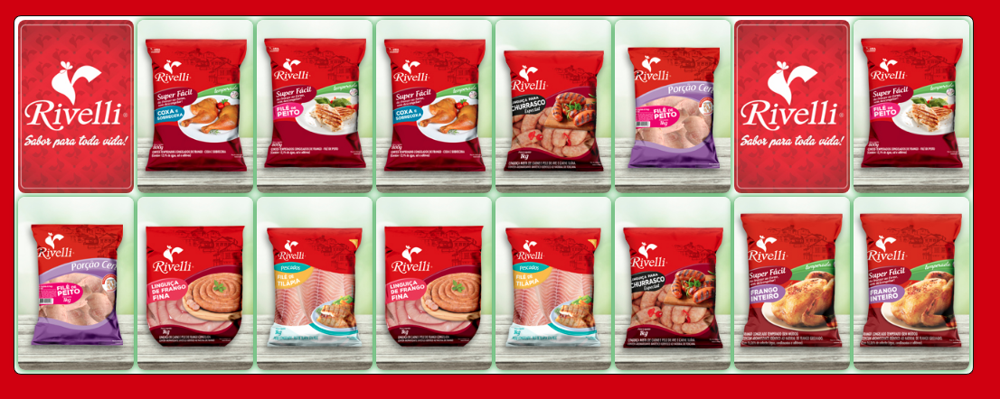
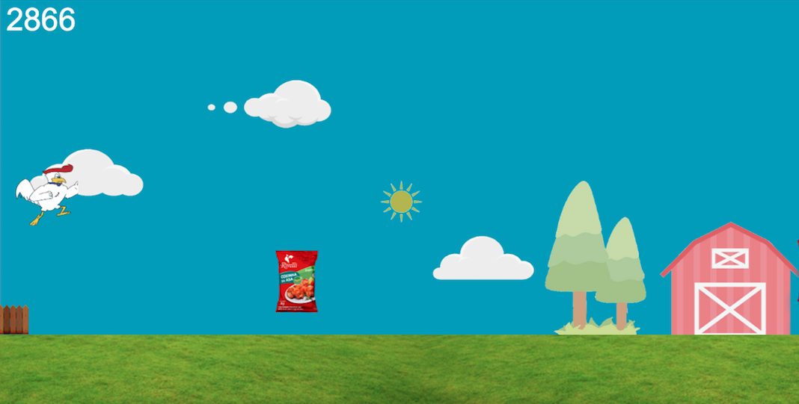

<h4 align="center"> 
	Jogos da Rivelli - FEICOB 2019
</h4>

  

  
 
  

  
   

## 💻 Sobre o projeto

👨‍🏫 Estes jogos foram desenvolvidos para a empresa Rivelli Alimentos S/A para serem utilizados durante a Feira da Indústria e Comércio de Barbacena.

## 🧠 Jogo da Memória

<h1 align="center">
  
</h1>

Neste jogo, o jogador deverá virar duas cartas por vez e achar os pares das cartas. Os pares são formados por 7 produtos e o selo Agromais. O jogador que conseguisse finalizar o jogo com o menor número de jogadas, ganhava um prêmio durante a feira.

## 🏃‍♂️ Corrida do Elvis

<h1 align="center">
  
</h1>

Neste jogo, Elvis, o mascote da empresa, começa uma corrida no campo e precisa pegar os produtos para conseguir pontos. Com o passar do tempo, o jogo fica mais rápido e mais difícil. O objetivo é pular os obstáculos e pegar o maior número de produtos possíveis. O jogador que conseguisse o maior número de pontos, ganhava um prêmio durante a feira.

As sprites do Elvis foram desenhadas a mão e depois vetorizadas no InkScape.

## 🛠 Tecnologias

Os dois jogos foram desenvolvidos utilizando Javascript, HTML e CSS.

## 🚀 Como executar o projeto

Para executar os jogos, basta fazer o download do projeto e abrir os arquivos index.html no seu navegador.

## 😯 Como contribuir para o projeto

1. Faça um **fork** do projeto.
2. Crie uma nova branch com as suas alterações: `git checkout -b my-feature`
3. Salve as alterações e crie uma mensagem de commit contando o que você fez: `git commit -m "feature: My new feature"`
4. Envie as suas alterações: `git push origin my-feature`
> Caso tenha alguma dúvida confira este [guia de como contribuir no GitHub](https://github.com/firstcontributions/first-contributions)

## 📝 Licença

Este projeto esta sobe a licença MIT.

Feito com ❤️ por André Souza 👋🏽 [Entre em contato!](https://www.linkedin.com/in/andrefmsouza/)